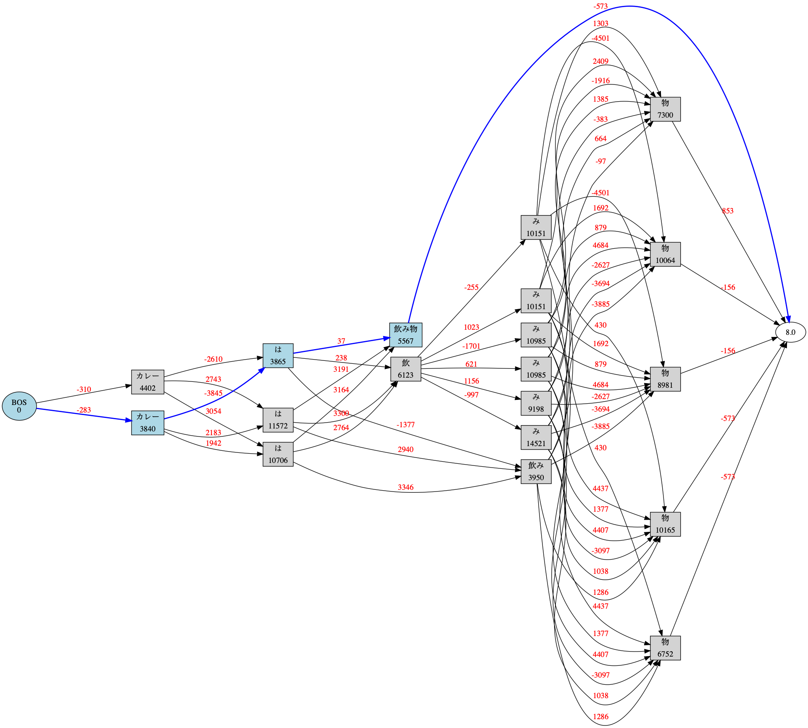

.. janome documentation master file, created by
   sphinx-quickstart on Tue Apr  7 21:28:41 2015.
   You can adapt this file completely to your liking, but it should at least
   contain the root `toctree` directive.

.. role:: strike

.. meta::
  :description: Janome (蛇の目; ◉) is a Japanese morphological analysis engine (or tokenizer, pos-tagger) written in pure Python including the built-in dictionary and the language model. We aim to build a library which is easy to install and provides concise, well-designed APIs for various python applications.
  :keywords: python, janome, pos tagger, tokenizer, morphological analysis, japanese
  :http-equiv=Content-Type: text/html; charset=UTF-8

Welcome to janome's documentation! (English)
=============================================

`日本語 <http://janome.mocobeta.dev/ja/>`_

What's Janome?
--------------

Janome (蛇の目; ◉) is a Japanese morphological analysis engine (or tokenizer, pos-tagger) written in pure Python including the built-in dictionary and the language model.

We aim to build a library which is easy to install and provides concise, well-designed APIs for various python applications.

Janome uses mecab-ipadic-2.7.0-20070801 as the built-in dictionary. Also Japanese new era "令和" (Reiwa) has been added to the dictionary since v0.3.8.

Source Code
-----------

`https://github.com/mocobeta/janome <https://github.com/mocobeta/janome>`_

If you like janome, please star the repository! :)

API reference
-------------

`https://janome.mocobeta.dev/reference/ <http://janome.mocobeta.dev/reference/>`_

Requirements
------------

Python 3.7+ interpreter

Latest version
--------------

* 0.5.0

Install
-------

PyPI
^^^^

`https://pypi.python.org/pypi/Janome <https://pypi.python.org/pypi/Janome>`_

.. code-block:: bash

  $ pip install janome

.. note:: This requires 500 to 600 MB RAM for pre-compiling the dictionary data.

Usage
-----

Create janome.tokenizer.Tokenizer object and call tokenize() method with the sentences you want to analyze.

The return value is a gnerator of Token objects. Token includes morphologic information such as surface form, part-of-speech. See `reference <http://janome.mocobeta.dev/reference/janome.html#janome.tokenizer.Token>`_ for more details.

::

  >>> from janome.tokenizer import Tokenizer
  >>> t = Tokenizer()
  >>> for token in t.tokenize('すもももももももものうち'):
  ...     print(token)
  ...
  すもも 名詞,一般,*,*,*,*,すもも,スモモ,スモモ
  も    助詞,係助詞,*,*,*,*,も,モ,モ
  もも  名詞,一般,*,*,*,*,もも,モモ,モモ
  も    助詞,係助詞,*,*,*,*,も,モ,モ
  もも  名詞,一般,*,*,*,*,もも,モモ,モモ
  の    助詞,連体化,*,*,*,*,の,ノ,ノ
  うち  名詞,非自立,副詞可能,*,*,*,うち,ウチ,ウチ

for Windows users
^^^^^^^^^^^^^^^^^

Use ``decode('utf8')`` if the output is garbled.

::

  >>> from janome.tokenizer import Tokenizer
  >>> t = Tokenizer()
  >>> for token in t.tokenize('すもももももももものうち'):
  ...     print(str(token).decode('utf8'))

How to use with user defined dictionary
---------------------------------------

MeCab IPADIC format
^^^^^^^^^^^^^^^^^^^

You can add custom entries besides the built-in dictionary at runtime by using user defined dictionary.

Default dictionary format is equal to MeCab IPADIC format. Create a CSV file as below and pass the file path and the character encoding to Tokenizer's constructor.

See the `MeCab document <http://taku910.github.io/mecab/dic.html>`_ for more details.

userdic.csv ::

  東京スカイツリー,1288,1288,4569,名詞,固有名詞,一般,*,*,*,東京スカイツリー,トウキョウスカイツリー,トウキョウスカイツリー
  東武スカイツリーライン,1288,1288,4700,名詞,固有名詞,一般,*,*,*,東武スカイツリーライン,トウブスカイツリーライン,トウブスカイツリーライン
  とうきょうスカイツリー駅,1288,1288,4143,名詞,固有名詞,一般,*,*,*,とうきょうスカイツリー駅,トウキョウスカイツリーエキ,トウキョウスカイツリーエキ

::

  >>> from janome.tokenizer import Tokenizer
  >>> t = Tokenizer("userdic.csv", udic_enc="utf8")
  >>> for token in t.tokenize('東京スカイツリーへのお越しは、東武スカイツリーライン「とうきょうスカイツリー駅」が便利です。'):
  ...   print(token)
  ...

  東京スカイツリー         名詞,固有名詞,一般,*,*,*,東京スカイツリー,トウキョウスカイツリー,トウキョウスカイツリー
  へ        助詞,格助詞,一般,*,*,*,へ,ヘ,エ
  の        助詞,連体化,*,*,*,*,の,ノ,ノ
  お越し    名詞,一般,*,*,*,*,お越し,オコシ,オコシ
  は        助詞,係助詞,*,*,*,*,は,ハ,ワ
  、        記号,読点,*,*,*,*,、,、,、
  東武スカイツリーライン    名詞,固有名詞,一般,*,*,*,東武スカイツリーライン,トウブスカイツリーライン,トウブスカイツリーライン
  「        記号,括弧開,*,*,*,*,「,「,「
  とうきょうスカイツリー駅  名詞,固有名詞,一般,*,*,*,とうきょうスカイツリー駅,トウキョウスカイツリーエキ,トウキョウスカイツリーエキ
  」        記号,括弧閉,*,*,*,*,」,」,」
  が        助詞,格助詞,一般,*,*,*,が,ガ,ガ
  便利      名詞,形容動詞語幹,*,*,*,*,便利,ベンリ,ベンリ
  です      助動詞,*,*,*,特殊・デス,基本形,です,デス,デス
  。        記号,句点,*,*,*,*,。,。,。

Simplified dictionary format (v0.2.7+)
^^^^^^^^^^^^^^^^^^^^^^^^^^^^^^^^^^^^^^

Janome provides alternative simplified dictionary format similar to `Kuromoji <https://www.atilika.com/en/kuromoji/>`_ user dictionary. This format supports surface form, part-of-speech and reading only.

To use simplified dictionary format, create a CSV file that includes "<surface form>,<part-of-speech>,<reading>" in each line (see the example below) and pass the file path and the dictionary type ``(udic_type='simpledic')`` to Tokenizer's constructor.

user_simpledic.csv ::

   東京スカイツリー,カスタム名詞,トウキョウスカイツリー
   東武スカイツリーライン,カスタム名詞,トウブスカイツリーライン
   とうきょうスカイツリー駅,カスタム名詞,トウキョウスカイツリーエキ

::

   >>> from janome.tokenizer import Tokenizer
   >>> t = Tokenizer("user_simpledic.csv", udic_type="simpledic", udic_enc="utf8")
   >>> for token in t.tokenize('東京スカイツリーへのお越しは、東武スカイツリーライン「とうきょうスカイツリー駅」が便 利です。'):
   ...   print(token)
   ...
   東京スカイツリー	カスタム名詞,*,*,*,*,*,東京スカイツリー,トウキョウスカイツリー,トウキョウスカイツリー
   へ    助詞,格助詞,一般,*,*,*,へ,ヘ,エ
   の    助詞,連体化,*,*,*,*,の,ノ,ノ
   お越し    名詞,一般,*,*,*,*,お越し,オコシ,オコシ
   は    助詞,係助詞,*,*,*,*,は,ハ,ワ
   、    記号,読点,*,*,*,*,、,、,、
   東武スカイツリーライン   カスタム名詞,*,*,*,*,*,東武スカイツリーライン,トウブスカイツリーライン,トウブスカイツリーライン
   「    記号,括弧開,*,*,*,*,「,「,「
   とうきょうスカイツリー駅    カスタム名詞,*,*,*,*,*,とうきょうスカイツリー駅,トウキョウスカイツリーエキ,トウキョウスカイツリーエキ
    」   記号,括弧閉,*,*,*,*,」,」,」
   が    助詞,格助詞,一般,*,*,*,が,ガ,ガ
   便利    名詞,形容動詞語幹,*,*,*,*,便利,ベンリ,ベンリ
   です    助動詞,*,*,*,特殊・デス,基本形,です,デス,デス
   。    記号,句点,*,*,*,*,。,。,。

Pre-compiled user dictionary
^^^^^^^^^^^^^^^^^^^^^^^^^^^^

With large user dictionary, it can take much time to convert CSV file to the binary data structure. You can compile the user dictionary in advance and use that at runtime.

For now, there is no tools for compiling user dictionary. Use `APIs <http://janome.mocobeta.dev/reference/janome.html#janome.dic.UserDictionary>`_ as below. ``progress_handler`` option is supported in v0.4.1 or above.

How to compile user dictionary (MeCab IPADIC format): ::

  >>> from janome.dic import UserDictionary
  >>> from janome import sysdic
  >>> from janome.progress import SimpleProgressIndicator
  >>> user_dict = UserDictionary("userdic.csv", "utf8", "ipadic", sysdic.connections, progress_handler=SimpleProgressIndicator(update_frequency=0.01))
  Reading user dictionary from CSV: 100.0% | 17149/17149
  Running create_minimum_transducer: 100.0% | 17149/17149
  >>> user_dict.save("/tmp/userdic")

How to compile user dictionary (simplified format): ::  

  >>> from janome.dic import UserDictionary
  >>> from janome import sysdic
  >>> from janome.progress import SimpleProgressIndicator
  >>> user_dict = UserDictionary("user_simpledic.csv", "utf8", "simpledic", sysdic.connections, progress_handler=SimpleProgressIndicator(update_frequency=0.01))
  Reading user dictionary from CSV: 100.0% | 17149/17149
  Running create_minimum_transducer: 100.0% | 17149/17149
  >>> user_dict.save("/tmp/userdic")

Once compiling has been successfully completed, the data is saved in ``/tmp/userdic`` directory. Pass the directory path to Tokenizer's constructor to use it.

::

  >>> t = Tokenizer("/tmp/userdic")

.. note:: Use same major python version at both compile time and runtime. Forward/backward dictionary data compatibility is not guaranteed.

(experimental) Analyzer framework (v0.3.4+)
-------------------------------------------------

Analyzer framework is for pre- and post- processing. Analyzer framework includes following classes.

* `CharFilter <http://janome.mocobeta.dev/reference/janome.html#janome.charfilter.CharFilter>`_ class performs pre-processing such as character normalization.
* `TokenFilter <http://janome.mocobeta.dev/reference/janome.html#janome.tokenfilter.TokenFilter>`_ class performs post-processing such as lowercase/uppercase conversion, token filtering by POS tags.
* `Analyzer <http://janome.mocobeta.dev/reference/janome.html#janome.analyzer.Analyzer>`_ class combines CharFilters, a Tokenizer and TokenFilters to assemble custom analysis chain.

Analyzser usage
^^^^^^^^^^^^^^^^^^^^

::

  >>> from janome.tokenizer import Tokenizer
  >>> from janome.analyzer import Analyzer
  >>> from janome.charfilter import *
  >>> from janome.tokenfilter import *
  >>> text = '蛇の目はPure Ｐｙｔｈｏｎな形態素解析器です。'
  >>> char_filters = [UnicodeNormalizeCharFilter(), RegexReplaceCharFilter('蛇の目', 'janome')]
  >>> tokenizer = Tokenizer()
  >>> token_filters = [CompoundNounFilter(), POSStopFilter(['記号','助詞']), LowerCaseFilter()]
  >>> a = Analyzer(char_filters=char_filters, tokenizer=tokenizer, token_filters=token_filters)
  >>> for token in a.analyze(text):
  ...     print(token)
  ... 
  janome  名詞,固有名詞,組織,*,*,*,*,*,*
  pure    名詞,固有名詞,組織,*,*,*,*,*,*
  python  名詞,一般,*,*,*,*,*,*,*
  な       助動詞,*,*,*,特殊・ダ,体言接続,だ,ナ,ナ
  形態素解析器  名詞,複合,*,*,*,*,形態素解析器,ケイタイソカイセキキ,ケイタイソカイセキキ
  です     助動詞,*,*,*,特殊・デス,基本形,です,デス,デス

Analyzer usage for word count (v0.3.5+)
^^^^^^^^^^^^^^^^^^^^^^^^^^^^^^^^^^^^^^^^^^

You can count word frequencies in the input text by using TokenCountFilter.

::

  >>> from janome.tokenizer import Tokenizer
  >>> from janome.analyzer import Analyzer
  >>> from janome.tokenfilter import *
  >>> text = 'すもももももももものうち'
  >>> token_filters = [POSKeepFilter(['名詞']), TokenCountFilter()]
  >>> a = Analyzer(token_filters=token_filters)
  >>> for k, v in a.analyze(text):
  ...   print('%s: %d' % (k, v))
  ...
  すもも: 1
  もも: 2
  うち: 1

See API reference for other built-in CharFilters and TokenFilters. You can implement custom filters by extending CharFilter or TokenFilter.

Streaming mode (v0.3.1 - v0.3.10)
----------------------------------

.. note:: As of v0.4.0, janome supports streaming mode only; ``stream`` option was removed.

When ``stream = True`` option is given to tokenize() method, it runs on streaming mode. On streaming mode, partial analyzed results are returned through `generator <https://wiki.python.org/moin/Generators>`_ interface.

Use this option when you analyze very large text data.

.. code-block:: python

  t = Tokenizer()
  with open('very_large_text.txt') as f:
      txt = f.read()
      for token in t.tokenize(txt, stream=True):
          print(token)

'wakati-gaki' mode (v0.3.1+)
-------------------------------

When 'wakati = True' option is given to tokenize() method, it runs on 'wakati-gaki' ('分かち書き') mode. On wakati-gaki mode, tokenize() method returns sufrace forms only. Return type is a list of string, not list of Token.

::

  >>> t = Tokenizer()
  >>> tokens = t.tokenize('分かち書きモードがつきました！', wakati=True)
  >>> tokens
  ['分かち書き', 'モード', 'が', 'つき', 'まし', 'た', '！']

If you use 'wakati-gaki' mode only, it is recommended to give ``wakati = True`` option to Tokenizer.__init__(). When Tokenizer object is initialized as below, extra information (detailed part of speech, reading, etc.) for tokens are not loaded from dictionary so the memory usage is reduced.

::

  >>> t = Tokenizer(wakati=True)

When this option is passed to Tokenizer object, tokenize() method always runs in wakati-gaki mode (``wakati = False`` option is ignored.)

'wakati-gaki' mode works well with streaming mode. tokenize() method returns generator of string when it is given ``stream=True`` and ``wakati=True`` options.

.. code-block:: python

  t = Tokenizer()
  for token in t.tokenize(txt, stream=True, wakati=True):
      print(token)

Memory-mapped file support (v0.3.3+)
----------------------------------------

.. note:: Since v0.4.0 release, the default value of ``mmap`` option is set to ``True`` on 64bit architecture. On 32bit architecture, the default is ``False``.

If ``mmap=True`` option is given to Tokenizer.__init__(), dictionary entries are not loaded to process space but searched through memory-mapped file.

Graphviz file (DOT file) support (v0.3.7+)
-------------------------------------------------------------------

When ``dotfile=<dotfile output path>`` option is given, Tokenizer.tokenize() method converts the lattice graph to `Graphviz <https://graphviz.gitlab.io/>`_ DOT file. For performance reasons, this option is ignored when running on streaming mode or analyzing very long text.

``janome`` command (the details are mentioned later) has options to visualize the lattice graph easily.

Command-line interface (Linux/Mac v0.2.6+, Windows v0.3.7+)
------------------------------------------------------------

Janome has executable built-in script "janome" for command-line usage.

It reads a sentence at a time from standard input and outputs the analyzed results. To see supported options, type "janome -h".

Linux/Mac
^^^^^^^^^

::

    (env)$ janome
    猫は液体である
    猫    名詞,一般,*,*,*,*,猫,ネコ,ネコ
    は    助詞,係助詞,*,*,*,*,は,ハ,ワ
    液体  名詞,一般,*,*,*,*,液体,エキタイ,エキタイ
    で    助動詞,*,*,*,特殊・ダ,連用形,だ,デ,デ
    ある  助動詞,*,*,*,五段・ラ行アル,基本形,ある,アル,アル
    (Type Ctrl-C to quit.)

Windows
^^^^^^^

Use ``-e sjis`` option if the output is garbled.

::

    >janome -e sjis
    ウィンドウズでも簡単インストール
    ウィンドウズ    名詞,固有名詞,一般,*,*,*,ウィンドウズ,ウィンドウズ,ウィンドウズ
    で      助詞,格助詞,一般,*,*,*,で,デ,デ
    も      助詞,係助詞,*,*,*,*,も,モ,モ
    簡単    名詞,形容動詞語幹,*,*,*,*,簡単,カンタン,カンタン
    インストール    名詞,一般,*,*,*,*,インストール,インストール,インストール
    (Type Ctrl-Z to quit.)

Visualizing lattice graph
^^^^^^^^^^^^^^^^^^^^^^^^^

.. note:: 

  You need Graphviz to use this functionality. Please install Graphviz from `here <https://graphviz.gitlab.io/download/>`_.

If given ``-g`` option, janome command outputs the visualized lattice image to the current directory after analyzing the text. Default output format is PNG.

:: 

    $ echo "カレーは飲み物" | janome -g
    カレー	名詞,一般,*,*,*,*,カレー,カレー,カレー
    は	助詞,係助詞,*,*,*,*,は,ハ,ワ
    飲み物	名詞,一般,*,*,*,*,飲み物,ノミモノ,ノミモノ
    Graph was successfully output to lattice.gv.png

lattice.gv.png (Click to show the full size image.)

You can change the output file location by using ``--gv-out`` option. Also you can specify the output file format by ``--gv-format`` option. See `Graphviz documentation <https://graphviz.gitlab.io/_pages/doc/info/output.html>`_ for all supported output formats.

:: 

    $ echo "カレーは飲み物" | janome -g --gv-out /tmp/a.gv --gv-format svg
    ...
    Graph was successfully output to /tmp/a.gv.svg

How to bundle janome with an application by PyInstaller (v0.3.9+)
--------------------------------------------------------------------

You can create (and distribute) stand-alone executables which bundle janome by `PyInstaller <https://www.pyinstaller.org/>`_.

``mmap=False`` option is required when initializing Tokenizer.

::

    (venv) $ janome --version
    janome 0.3.9
    (venv) $ pyinstaller -v
    3.4

    (venv) $ cat test.py 
    # -*- utf-8
    from janome.tokenizer import Tokenizer
    t = Tokenizer(mmap=False)
        for token in t.tokenize('令和元年'):
        print(token)

    (venv) $ pyinstaller --onefile test.py 
    44 INFO: PyInstaller: 3.4
    44 INFO: Python: 3.6.6
    ...

    (venv) $ ls dist/
    test
    (venv) $ ./dist/test 
    令和	名詞,固有名詞,一般,*,*,*,令和,レイワ,レイワ
    元年	名詞,一般,*,*,*,*,元年,ガンネン,ガンネン

FAQ
---

Q. How is the accuracy of analysis?

A. Janome uses MeCab IPADIC dictionary, so the accuracy is roughly same to MeCab.

Q. How is the speed of analysis?

A. Basically depends on the input length. According to my benchmark script, one sentence would take a few milliseconds to a few tens of milliseconds on commodity PCs.

Q. What data structures and algorithms are used?

A. Janome uses FST (`Minimal Acyclic Subsequential Transducer <http://citeseerx.ist.psu.edu/viewdoc/summary?doi=10.1.1.24.3698>`_) for internal dictionary data structure. I implemented the automaton by referring to `Apache Lucene <https://lucene.apache.org/core/>`_ (written in Java) and `kagome <https://github.com/ikawaha/kagome>`_ (written in Go). And for analysis engine, I implemented basic viterbi algorithm by referring the book `自然言語処理の基礎 <http://www.amazon.co.jp/%E8%87%AA%E7%84%B6%E8%A8%80%E8%AA%9E%E5%87%A6%E7%90%86%E3%81%AE%E5%9F%BA%E7%A4%8E-%E5%A5%A5%E6%9D%91-%E5%AD%A6/dp/4339024511>`_ .

Q. I found bugs. Or have requests for enhancement.

A. Bug reports or requests (and of course, patches) are welcome. Create issues in `Github repository <https://github.com/mocobeta/janome/issues>`_ or leave your comment to `Gitter room <https://gitter.im/janome-python/en>`_.

For Contributors
----------------

See `https://github.com/mocobeta/janome/blob/master/CONTRIBUTING.md <https://github.com/mocobeta/janome/blob/master/CONTRIBUTING.md>`_

Author
---------

`Profile <https://blog.mocobeta.dev/about/>`_

License
------------

Licensed under Apache License 2.0 and uses the MeCab-IPADIC dictionary/statistical model.

See `LICENSE.txt <https://github.com/mocobeta/janome/blob/master/LICENSE.txt>`_ and `NOTICE.txt <https://github.com/mocobeta/janome/blob/master/NOTICE.txt>`_ for license details.

Copyright
-----------

Copyright(C) 2015-2025, Tomoko Uchida. All rights reserved.

History
----------

* 2023.07.01 janome Version 0.5.0 released `[Release Note] <https://github.com/mocobeta/janome/releases/tag/0.5.0>`_
* 2022.02.23 janome Version 0.4.2 released `[Release Note] <https://github.com/mocobeta/janome/releases/tag/0.4.2>`_
* 2020.09.21 janome Version 0.4.1 released
* 2020.08.23 janome Version 0.4.0 released
* 2019.11.03 janome Version 0.3.10 released
* 2019.05.12 janome Version 0.3.9 released
* 2019.04.03 janome Version 0.3.8 released
* 2018.12.11 janome Version 0.3.7 released
* 2017.12.07 janome Version 0.3.6 released
* 2017.08.06 janome Version 0.3.5 released
* 2017.07.29 janome Version 0.3.4 released
* 2017.07.23 janome Version 0.3.3 released
* 2017.07.05 janome Version 0.3.2 released 
* 2017.07.02 janome Version 0.3.1 released
* 2017.06.30 janome Version 0.3.0 released
* 2016.05.07 janome Version 0.2.8 released
* 2016.03.05 janome Version 0.2.7 released
* 2015.10.26 janome Version 0.2.6 released
* 2015.05.11 janome Version 0.2.5 released
* 2015.05.03 janome Version 0.2.4 released
* 2015.05.03 janome Version 0.2.3 released
* 2015.04.24 janome Version 0.2.2 released
* 2015.04.24 janome Version 0.2.0 released
* 2015.04.11 janome Version 0.1.4 released
* 2015.04.08 janome Version 0.1.3 released

Change details: `CHANGES <https://github.com/mocobeta/janome/blob/master/CHANGES.txt>`_

.. image:: ../img/bronze-25C9.png
   :alt: Badge(FISHEYE)
   :target: https://home.unicode.org/adopt-a-character/about-adopt-a-character/
